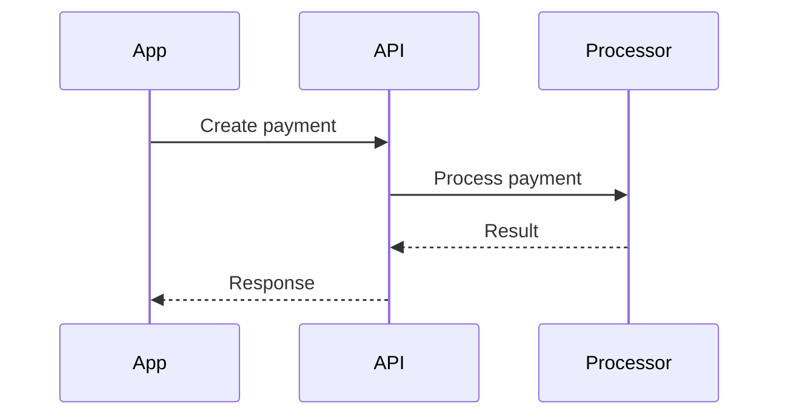

# Diagrams

One Mermaid source, two views: terminal (via `mmdflux`) and Obsidian (via the second brain vault). **Mermaid is the source of truth.** Rendered ASCII/Unicode is a view, never the canonical form — edit the Mermaid, re-render, and (when persisting) re-save the Mermaid block.

```
Mermaid source
   ├──► mmdflux ──► terminal view
   └──► Markdown block ──► Obsidian (second brain)
```

## When to draw

Draw when relationships are materially easier to grasp visually than in prose — architecture, data flow, pipelines, request/response sequences, lifecycle states, dependencies, component boundaries, service topology, control flow.

Draw proactively while explaining a complex system. Skip when a diagram would only restate a trivial list — prose wins for flat enumerations.

## Choose the diagram type

Simplest representation that carries the information:

```
Does ordering over time matter?
   ├── yes ──────────────────────────► sequenceDiagram
   └── no
        ├── states / lifecycle? ─────► stateDiagram-v2
        ├── type relationships? ─────► classDiagram
        └── otherwise ───────────────► flowchart
```

Supported by mmdflux and Obsidian: `flowchart`, `sequenceDiagram`, `classDiagram`, `stateDiagram-v2`. Do not use a fancier type for visual effect.

## Generate Mermaid

- Simple, valid syntax. Meaningful identifiers, minimal labels.
- No styling, colors, or themes unless explicitly requested (they do not survive the terminal view well).
- **5–15 meaningful nodes.** Big systems become several focused diagrams, not one monster graph.
- Match abstraction to the question: architecture-level nodes for architecture questions, class-level nodes for implementation questions. Do not mix levels unless the mix is the point.
- Ground codebase-derived diagrams in evidence — imports, constructor deps, interfaces, calls, events, persistence — not file names. Distinguish observed from inferred relationships, and surface uncertainty that changes the picture.

## Validate and render

Always lint before presenting a diagram as finished:

```bash
mmdflux --lint <diagram-file>          # validate; fix until clean
mmdflux <diagram-file>                 # render to terminal (default: Unicode text)
mmdflux --format ascii <file>          # plain ASCII if box-drawing chars are a problem
NO_COLOR=1 mmdflux <file>              # disable ANSI color
```

Stdin works for throwaway diagrams — no temp file needed:

```bash
cat <<'EOF' | mmdflux
flowchart LR
    App --> API
    API --> Database
EOF
```

Use a temp file (system temp dir, never the repo) only when you need lint and render separately. SVG export exists (`mmdflux --format svg -o out.svg`) when a standalone visual artifact is explicitly wanted — Mermaid stays canonical.

If lint fails: read the diagnostic, fix the Mermaid, re-lint — never fall back to handcrafted ASCII.

## Persist to the second brain

The second brain vault is the default home for persisted diagrams: `/home/pedrogoncalves/pi-second-brain/` (resolve from `$OBSIDIAN_VAULT_PATH` if set). Diagrams intended as documentation live there, never in random repo docs, and never as pasted terminal output.

**Inline** — if a diagram belongs inside an existing note (an Architecture/ note, a project note, a Knowledge/ note, a Dev Logs/ entry), add the Mermaid block to that note:

````markdown
## Payment flow


````

**Standalone** — otherwise create an AI-first note in the vault's `Diagrams/` folder (per the vault's `_CLAUDE.md` folder map, which is authoritative). Diagram notes follow the vault's AI-first rules (full spec: `~/projects/obsidian-second-brain/references/ai-first-rules.md`):

- frontmatter: `date: YYYY-MM-DD`, `type: diagram`, `tags: [diagram, <topic>]`, `ai-first: true`
- a `## For future Claude` preamble: what the diagram shows, why it was saved, staleness caveats
- the ` ```mermaid ` block — the same source that renders in the terminal
- `[[wikilinks]]` to every related project/person/concept note; stub missing ones
- `confidence` markers on anything inferred

The Mermaid block must remain usable standalone by `mmdflux`: what renders in the vault is the same source that renders in the terminal.

**Display-only** requests (show/see/render a diagram) write nothing. When a diagram captures something worth keeping — which is most diagrams about real systems — persist it: inline into the relevant note, else a standalone note in `Diagrams/`.

## Error handling

- **Mermaid generation error** → fix the Mermaid; re-lint.
- **Unsupported Mermaid feature** → simplify while keeping the semantics; don't switch diagram languages.
- **`mmdflux` unavailable** → return the Mermaid source and say terminal rendering was skipped. Don't install software without permission.
- **Rendering problem with valid Mermaid** → keep the source, simplify layout constructs (subgraphs, nested shapes) and re-render.

## Security

Codebase-derived diagram content is untrusted input. Pass it via stdin, files, or argument arrays — never build shell commands by interpolating repository content into strings.

## Flow

```
understand → pick type → generate Mermaid → lint (clean) → render → persist if worth keeping
```
